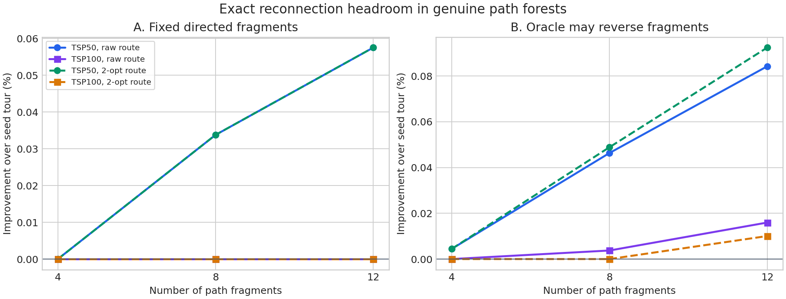
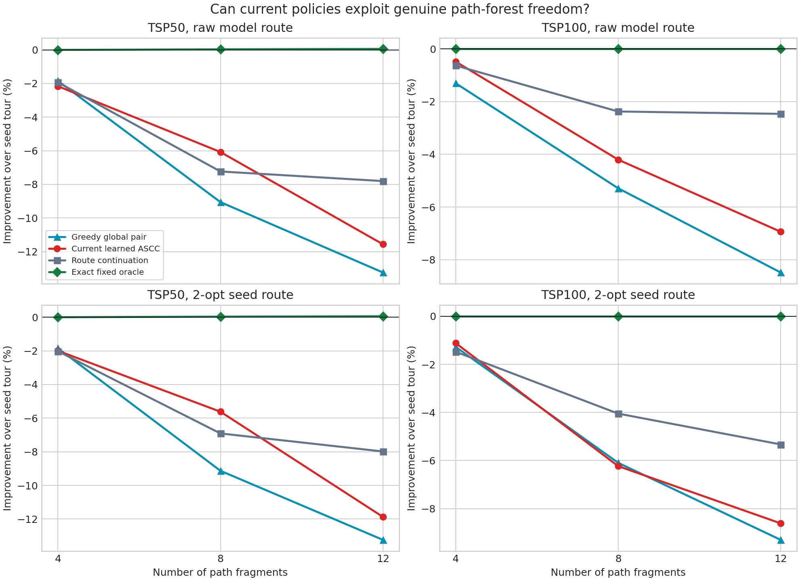
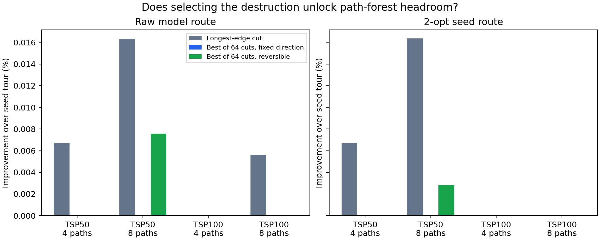

# ASCC 真实路径森林重连诊断

日期：2026-09-19。本轮只做诊断性实验，没有重新训练或改变 ASCC 核心模型。

## 问题

上一轮 rollout-value oracle 的起始状态是一条 route prefix 加若干孤立节点，并不是多条非平凡路径。本轮直接检验：

1. 从一条较好 tour 中删除多条边，得到真正的路径森林后，重新排列路径分量是否有改善空间；
2. 当前 learned ASCC 能否在这些状态上利用该空间；
3. 路径方向、destruction 位置是否才是主要自由度。

## 设计

- 基准解：现有 REINFORCE checkpoint 的 best-of-8 route rollout；
- 问题规模：TSP50 和 TSP100；
- 基准解类型：原始 route，以及对它执行 best-improvement 2-opt 后的 route；
- 分量数：4、8、12，每个路径分量至少包含两个节点；
- destruction：随机切边、最长边切断，以及每个实例枚举 64 组随机切断后取最好值；
- 精确计算：Held--Karp 对固定方向路径分量求最优环，另外计算允许每个分量整体反向的最优环；
- 检查：精确 DP 与小规模穷举一致，3 项独立测试通过。

主重连实验每个规模使用 48 个配对实例；best-of-64 destruction oracle 每个规模使用 32 个实例。

## 主要结果

下表均为相对原始 seed tour 的改善，正数越好。

| Destruction | 设置 | 固定方向精确 oracle | 可反向精确 oracle | 当前 learned ASCC |
|---|---|---:|---:|---:|
| 随机切边 | TSP50，12 段 | 约 0.000% | +0.0076% | -8.742% |
| 随机切边 | TSP100，12 段 | 约 0.000% | 约 0.000% | -4.325% |
| 最长边切断 | TSP50，12 段 | +0.0575% `[-0.0160, 0.1310]` | **+0.0843%** `[0.0083, 0.1602]` | -11.563% |
| 最长边切断 | TSP100，12 段 | 约 0.000% | +0.0160% `[-0.0051, 0.0370]` | -6.939% |

2-opt 后的 seed tour 得到同样结论。TSP50 的最长边切断、12 段、可反向 oracle 为 +0.0924%；TSP100 为 +0.0101%，区间包含 0。

best-of-64 destruction oracle 没有将空间放大：

| 设置 | 64 组随机切断中最好的固定方向 oracle | 最好的可反向 oracle |
|---|---:|---:|
| TSP50，4 段 | 约 0.000% | 约 0.000% |
| TSP50，8 段 | 约 0.000% | +0.0076% `[0.0002, 0.0149]` |
| TSP100，4 段 | 约 0.000% | 约 0.000% |
| TSP100，8 段 | 约 0.000% | 约 0.000% |

## 解释

1. **当前路径森林邻域太刚性。** 分量内部边被全部冻结，只重排完整路径块。对较好的 tour，原有块顺序几乎总是这个受限邻域中的最优解。
2. **方向自由度有作用，但量级不够。** 允许整段反向通常比固定方向好，但目前最强的稳定信号仍只有约 0.08%--0.09%。
3. **destruction 选择不是主要瓶颈。** 从 64 组随机切法中挑最好值仍几乎没有改善；最长边切断略好，但不足以支撑训练一个新策略。
4. **现有 learned ASCC 不会处理这些状态。** 这些森林不在它的训练分布上，并且分量数越多，退化越明显。但即使完美训练当前动作空间，oracle 也表明可获得的收益太小。

## 决策

现在不应直接对当前 fixed-orientation tail--head policy 进行大规模训练，也不应立即扩展到 TSP500/1000 或 CVRP。当前的首要问题是动作空间，不是节点规模。

下一个 P0 实验应在同一批 seed tours 上比较四个精确邻域：

1. 当前的固定方向 component reorder；
2. 可反向 component reorder；
3. 允许额外释放一条分量内部边的 split-and-merge；
4. L2C 风格的 node removal and insertion。

只有当某个新邻域在 TSP50/100 上显示清楚、稳定且足以覆盖计算开销的 oracle headroom，才进入下一阶段：对 component orientation 和 joint pair 使用优质 tour 监督预训练，然后做与 L2C-Insert 的同时间直接对照。

## 复现

- 主脚本：`experiments/evaluate_fragment_reconnection.py`
- destruction oracle：`experiments/evaluate_fragment_destruction_oracle.py`
- 测试：`tests/test_fragment_reconnection.py`
- 服务器结果：`/workspace/计算群论/results/ascc-bopo-joint-20260919/fragment-reconnect-v1`
- 服务器结果：`/workspace/计算群论/results/ascc-bopo-joint-20260919/fragment-reconnect-longest-v1`
- 服务器结果：`/workspace/计算群论/results/ascc-bopo-joint-20260919/fragment-destruction-oracle-v1`
