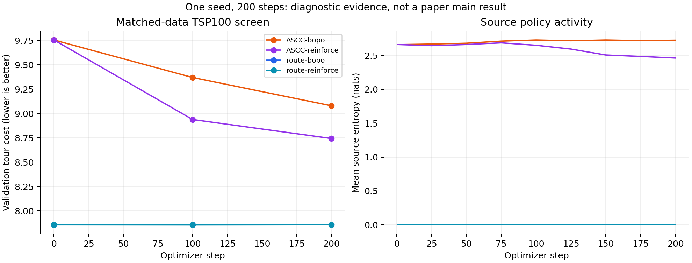

# ASCC × BOPO：实现推进与第一轮证伪筛查

日期：2026-09-19。结论：已实现并验证每步自由选择 source、联合训练 source/endpoint 的 BOPO 版本，但本轮没有建立相对强 route baseline 的性能优势。它是方法开发诊断，不是论文主结果。

## 1. 完成的工作与准确技术定义

远程独立仓库：`/workspace/计算群论/repos/groupopt-ascc-bopo-joint-20260919`，分支 `codex/ascc-bopo-joint-20260919`。训练代码固定在 `9d9dd33`；迁移诊断 `4b23cd0`；source 干预诊断 `c80118e`。原 canonical 源码和历史实验未覆盖。

- 每步从所有 unresolved source 中选择一个，再从 unused、不会提前闭合 subtour 的 image 中选 endpoint；第一步也允许自由 source。没有 continuation gate、换起点额度或硬 top-k pruning。
- state 是互不相交的有向路径森林；endpoint decoder 的 query 使用所选 source 所属路径的真实起点。增量维护路径起终点、分量和大小。
- 同一 trajectory 的分数是每条边的 `log π(source|state)+log π(endpoint|state,source)` 的平均。BOPO 按完整 tour cost 排序、按 rank 间隔选样、构造偏好对，同时更新两头和 backbone。它不是 final permutation 的边缘概率。
- hybrid rollout 明确保留一个 greedy 样本，其余 sampled；REINFORCE 对照不对 greedy action 使用 on-policy score 梯度。
- 这是新的 source-first 实现，不是旧 canonical ASCC 的数值等价改写。

代码依据：[模型](src/groupopt/models/ascc_bopo.py)、[偏好损失](src/groupopt/training/preference.py)、[训练入口](experiments/train_ascc_bopo.py)、[预先限定的协议](docs/ASCC_BOPO_PROTOCOL.md)。本地源码是审阅副本，完整运行依赖远程仓库。

## 2. 已验证与未验证

- 21 项测试通过，涵盖现有测试与新增可行性、replay、梯度、loss、checkpoint、hybrid 行为测试。四节点所有 Hamiltonian tours × 所有 source 顺序的 144 条构造轨迹均可达；这与完整图路径森林的 completion-preserving 论证一致，不能泛化成任意约束问题的证明。
- 官方 BOPO checkpoint 在 route 初始化模式下，TSP20/100 的全部起点动作和成本与上游逐项一致，最大成本差为 0。
- ASCC 的 source 和 endpoint 均有非零梯度；BOPO 第 200 步 source 梯度范数 0.5033、endpoint 梯度范数 0.08838。测试时约 91.62% 的可换 source 决策偏离 route continuation，排除了“基本没换起点”。
- source entropy 和偏好准确率只能说明策略活跃、目标得到优化，不能证明换起点有用。
- 完全相同的总参数数目不等于相同活跃容量：route 分支的 source 参数不参与动作选择。`route_capacity` 已实现并有梯度测试，但尚未完成训练对照。

证据：[实现验证](evidence/implementation_verification.json)、[官方兼容性](evidence/upstream_compatibility.json)、各 arm 的 `metrics.jsonl` / `config.json`。

## 3. TSP100 四组筛查

每组 200 steps × batch 4 × 16 trajectories；训练 seed 1234；相同预训练 checkpoint、训练坐标序列、优化器分组和学习率；validation 128、test 256；best-of-8 anchor contexts、无 augmentation、无局部搜索。检查点只按 validation 选择，包括 step 0；所有 final/best 结果保留。每组仅见 800 个训练实例，远不足以宣布充分收敛。

| Objective | Route baseline | +ASCC | Absolute Δ (route−ASCC) | Relative Δ | Train s (route/ASCC) | Test s (route/ASCC) | Seed |
| --- | ---: | ---: | ---: | ---: | ---: | ---: | --- |
| bopo | 7.807222 | 8.939863 | -1.132641 | -14.508% | 151.0/191.7 | 8.87/9.67 | 1234 |
| reinforce | 7.811115 | 8.640332 | -0.829217 | -10.616% | 145.1/189.4 | 9.21/10.16 | 1234 |

正 Δ 才表示 ASCC 改善。BOPO route 最佳为 step 0；RL route 最佳为 step 100；两个 ASCC 最佳均为 step 200。测试成本分别按各自 validation 选出的 checkpoint 报告。测试时间覆盖全部 256 个实例，GPU 为共享环境，仅供实现开销诊断；这里 route 也走共同 forest 引擎，不能据此声称与原生优化 decoder 等速。

BOPO paired difference 的条件 95% CI 为 [-1.203142, -1.062140]；RL 为 [-0.881121, -0.777313]。这些区间仅刻画固定已训练模型的实例差异，不包含训练 seed 方差。单 seed 不能建立统计稳定性。

ASCC+RL 当前测试成本 8.6403，优于 ASCC+BOPO 的 8.9399；在此预算与超参下，没有“BOPO 更适合 ASCC”的证据。不能由此推出充分训练或其他超参下 BOPO 必然更差。

完整数据：[comparison.json](evidence/screen-v1/comparison.json)、[SCREEN_RESULTS.md](evidence/screen-v1/SCREEN_RESULTS.md)。

## 4. 尺寸／分布迁移检查

固定上节 BOPO checkpoint；每格 32 个新实例，best-of-8、无 augmentation/局部搜索。TSP200/500/1000 × uniform/clustered 六格全部保留。未使用 OPT 标签，也未以这些结果重新选择 checkpoint。这些数据现已属于开发集。

| Size | Distribution | Route | ASCC | Relative improvement |
| --- | --- | ---: | ---: | ---: |
| 200 | uniform | 11.0408 | 14.3684 | -30.14% |
| 200 | clustered | 4.8722 | 6.5273 | -33.97% |
| 500 | uniform | 19.9602 | 26.7266 | -33.90% |
| 500 | clustered | 8.5458 | 12.2472 | -43.31% |
| 1000 | uniform | 30.7977 | 43.9663 | -42.76% |
| 1000 | clustered | 13.0113 | 21.3075 | -63.76% |

六格均为负结果。不能把“大尺寸／聚类可能有更多改进空间”当成当前 ASCC 在这些场景更强的证据；当前 checkpoint 在这些场景的泛化反而更差。没有 OPT 标签，因此此表也不能回答 BOPO 距 OPT 多近。

数据与固定检查点 hash：[transfer-v1/summary.json](evidence/transfer-v1/summary.json)。

## 5. 固定 checkpoint 的 source 干预

固定同一个 ASCC+BOPO 最佳 checkpoint，使用同一批 256 个 test 实例，仅替换 source policy。endpoint 保持 greedy；每次 best-of-8。random 的三次 action seed 分开报告，不合并成 best-of-24。

| Source policy | Mean cost | Cost−learned | Conditional 95% CI |
| --- | ---: | ---: | --- |
| learned | 8.939863 | 0.000000 | [0.000000, 0.000000] |
| route | 7.807378 | -1.132484 | [-1.202555, -1.062413] |
| fixed | 10.447947 | 1.508085 | [1.367967, 1.648203] |
| shortest | 10.548932 | 1.609070 | [1.470726, 1.747413] |
| random (7001) | 9.081108 | 0.141245 | [0.047255, 0.235235] |
| random (7002) | 9.063609 | 0.123746 | [0.034705, 0.212787] |
| random (7003) | 9.023671 | 0.083809 | [-0.009858, 0.177476] |

`shortest` 指节点数最少的路径分量，并非累计几何长度最短。fixed/shortest 的确定性选择可能让多个 anchor rollout 重复，因此此表不是策略种类的最终强弱排名。

learned 比 random 三次的均值都好，但一组条件 CI 包含 0；三次 action seed 不是三次训练 seed。route 在同一 checkpoint 上恢复到 7.8074，说明至少从 tour quality 看，endpoint 在原 route 状态上的能力没有明显受损。当前性能差距更集中在自由 source 下的决策及对应状态分布，尚不能区分 source 学得不够、forest endpoint 适配不足、joint credit assignment 和训练量不足。

**这不是 trained-random-source ablation。** 在 learned-source 的 checkpoint 上改推理策略，包含分布错配；不能据此声称充分训练的 learned source 优于充分训练的 random/heuristic，也不能用这些局部差异抵消相对 route 的负结果。

证据：[intervention-v1/summary.json](evidence/intervention-v1/summary.json)、[干预脚本](experiments/evaluate_source_intervention.py)。

## 6. 下一步方法选择与 ICLR 证据门槛

**P0：先检验“单路径预训练与路径森林状态不匹配”，再决定是否扩大训练。** 保留 native route 生成的完整好 tour，按不同 source 顺序 teacher-force 同一 successor permutation，让 endpoint 在森林状态下学习原 tour 的边。先做 forest warmup，再进行无 source gate 的联合训练。这复用已有完整解，不需要新 OPT 标签；它是否有效仍需实验。必须给 route 对照相同数据、更新数和计算预算，避免把额外预训练当作 ASCC 改进。

**P0：做真正的 trained-source 对照。** 在同样 warmup 与预算下分别训练 learned、random、fixed、shortest-component 与 route-capacity。固定 checkpoint 的 source 替换存在状态分布变化，不能替代这些训练消融。若 random 获得多数收益，核心主张应缩小为 forest construction，而不能宣称 adaptive learning 起主要作用。

**P0：训练曲线与等时间曲线。** 本轮每个 ASCC 都还在下降，不能据 200 步判死；但也不能用延长 ASCC、停止 baseline 来制造优势。预先给定相同训练样本预算，并补相同 wall-clock 预算与最终 convergence 诊断；保留每个 seed，而不是只报告 best seed。

**P1：出现可信信号后再做 ≥5 seeds、独立新 test、OPT/高质量 reference gap、现代强 host 和 matched decoding budget。** 当前仍未建立 H3（参数/算力排除）、H4（强 host 通用性）。BOPO 是训练方法；host 架构和训练目标应拆开表述。

**P1：优先按机制选问题，不按已观察到的正结果选数据。** 若“先处理可选 endpoint 更少的 source”是核心假设，完整图普通 TSP 中每条路径的合法后继分量数相同，无法直接支持该机制。可考虑受限边或其他非均匀约束任务，但需重新证明/验证 completion-preserving masking，不能直接沿用 complete-TSP 的 subtour mask。完整 TSP 的 size/OOD、ATSP 等应作为预先固定的验证矩阵，而非保证优势的场景。

**P2：机制轨迹。** 记录 endpoint entropy/margin、组件大小、跨簇合并、后续后悔值或小规模最优 completion regret；用同一状态下 source 干预比较后续 completion，区分信心排序、误差传播和简单 variable ordering。source entropy 本身不回答因果机制。

当前可以保守声称：我们实现了 completion-preserving 的 source-first 路径森林构造，并能对联合构造轨迹进行偏好训练。**本轮不能声称它优于强 route host，更不能承诺 ICLR 录用。** 顶会贡献仍缺可信的优势、相对 dynamic variable ordering 的明确方法增量、预算/容量消融和机制证据。

## 7. 保存与资源

所有新结果在服务器 `/workspace/计算群论/results/ascc-bopo-joint-20260919/`。只用了一个 GPU 的小额显存，四组训练总约 11.3 分钟（不含验证）；没有启动 TSP500/1000 大规模训练。系统 driver 未修改，仅对本任务设置项目内 CUDA library 路径。历史 smoke、正式 screen、迁移诊断和 source 干预分目录保存。
